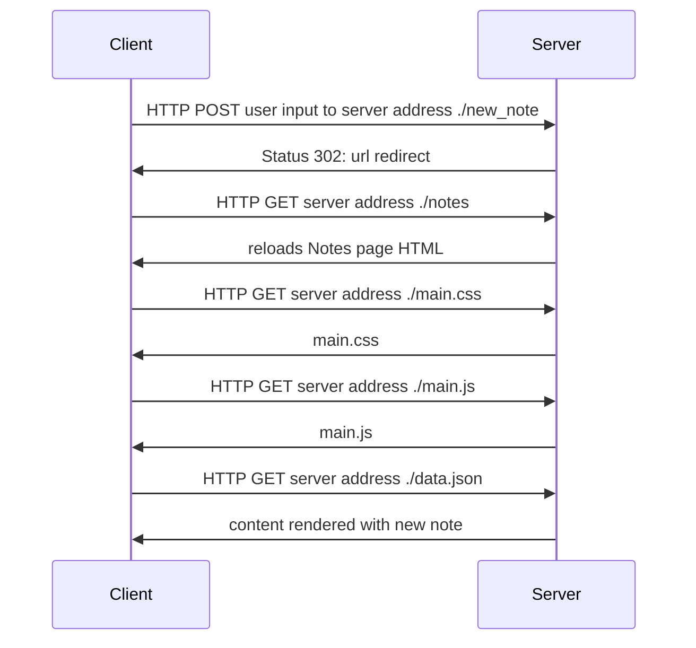

```mermaid
sequenceDiagram
    Client->>Server: HTTP POST user input to server address ./new_note
    Server->>Client: Status 302: url redirect
    Client->>Server: HTTP GET server address ./notes
    Server->>Client: reloads Notes page HTML
    Client->>Server: HTTP GET server address ./main.css
    Server->>Client: main.css
    Client->>Server: HTTP GET server address ./main.js
    Server->>Client: main.js
    Client->>Server: HTTP GET server address ./data.json
    Server->>Client: content rendered with new note
```
