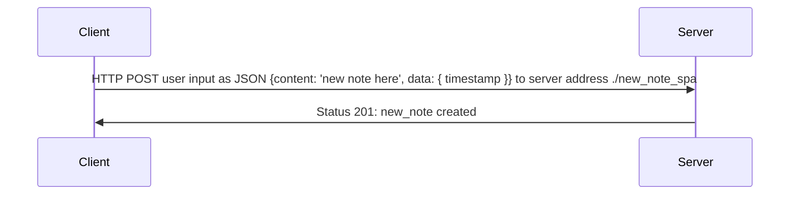

```mermaid
sequenceDiagram
    Client->>Server: HTTP POST user input as JSON {content: 'new note here', data: { timestamp }} to server address ./new_note_spa
    Server->>Client: Status 201: new_note created
```
